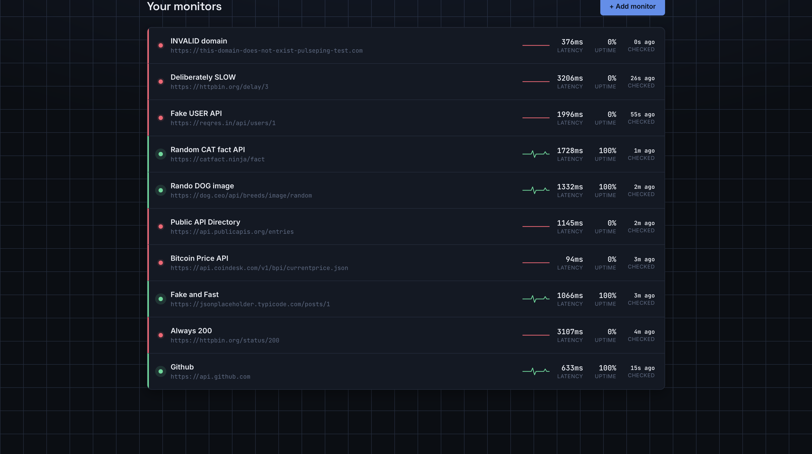
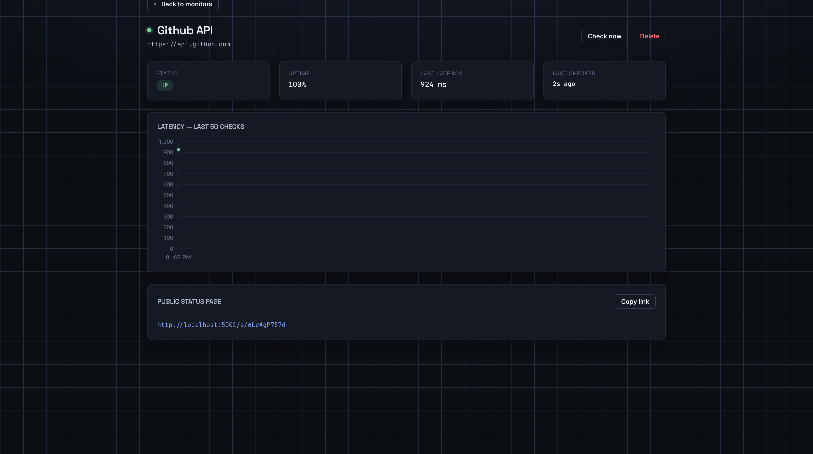
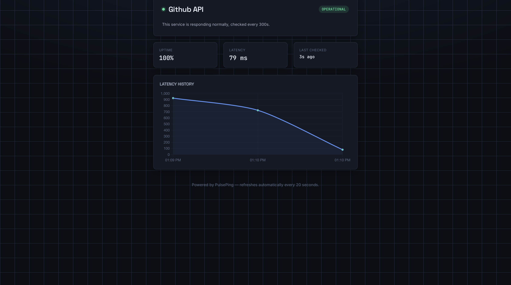
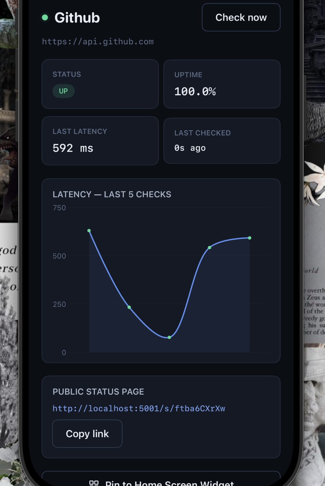
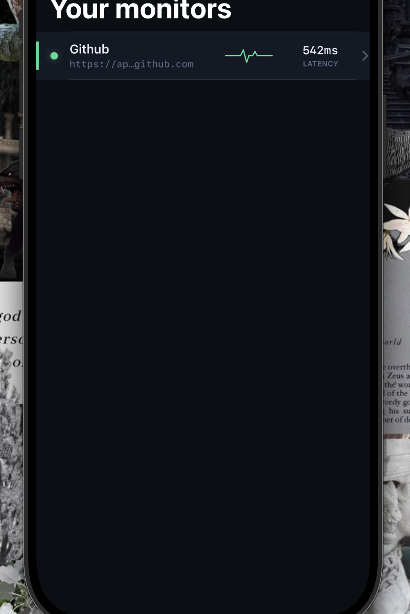

# PulsePing

**Know the instant something goes down.**

A full-stack uptime & latency monitor built for early-stage founders — a dark-mode web dashboard paired with a native SwiftUI iOS companion app, both talking to the same Node.js/Express backend.


---

## What it does

Add an API endpoint or server URL, and PulsePing checks it on a real schedule — logging latency, status code, and uptime history for every single check. No enterprise observability stack, no config sprawl. Just a live dashboard, a public status page you can share, and (soon) a push notification the second something breaks.

**Full write-up of the build — architecture decisions, and five real production bugs fixed live — is in [`docs/PulsePing-Documentation.pdf`](docs/PulsePing-Documentation.pdf).**

---

## Screenshots

### Web dashboard
Live monitor list with an animated pulse-line status indicator — a signature visual motif tying back to the product name.



### Monitor detail
Latency history chart, uptime %, and a shareable public status link.



### Public status page
No login required — share this link with your team or in an investor update.



### iOS app
Native SwiftUI companion, same backend, same data — theme ported 1:1 from the web app's CSS tokens.

<p>
  
  
</p>

---

## Features

**Web**
- Auth: register, login, forgot/reset password, change password, rate-limited against brute force
- Add / edit / delete monitors, manual "check now," per-monitor public/private toggle
- Live dashboard (15s polling), Chart.js latency graphs, public no-login status pages
- Transactional email: welcome on signup, login security alerts, password reset

**iOS (SwiftUI)**
- Full native auth flow with Keychain-backed JWT storage
- Monitor list & detail with Swift Charts, swipe-to-delete
- Settings screen with an editable backend URL (dev/prod switching without a rebuild)
- Home Screen Widget & push notifications: fully coded, gated behind a paid Apple Developer account ([see `Phase2-Optional-WidgetAndPush/`](PulsePingiOS/Phase2-Optional-WidgetAndPush))

**Backend**
- Background ping engine (`node-cron`, 30s sweep, per-monitor interval) with automatic status-flip detection
- REST API, JWT auth, bcrypt hashing, rate limiting, hashed password-reset tokens
- Deployed on Railway, auto-deploys on push to `main`

---

## Tech stack

| Layer | Stack |
|---|---|
| Backend | Node.js, Express, Mongoose |
| Database | MongoDB Atlas |
| Scheduler | node-cron |
| Email | Resend (HTTPS API — see [why not SMTP](#a-note-on-email)) |
| Web frontend | Vanilla HTML/CSS/JS, Chart.js |
| iOS | SwiftUI, Swift Charts, Combine |
| Hosting | Railway |
| Auth | JWT, bcrypt |

---

## Architecture

```
┌─────────────────┐        ┌──────────────────┐        ┌─────────────────┐
│   Web Dashboard  │◄──────►│   Express API      │◄──────►│    iOS App       │
│   HTML/CSS/JS    │        │   (Railway)        │        │    SwiftUI       │
└─────────────────┘        └──────────────────┘        └─────────────────┘
                                     │
                     ┌───────────────┼───────────────┐
                     ▼               ▼               ▼
              ┌────────────┐  ┌────────────┐  ┌────────────┐
              │  node-cron  │  │  MongoDB    │  │  Resend     │
              │  30s sweep  │  │  Atlas      │  │  (email)    │
              └────────────┘  └────────────┘  └────────────┘
```

One backend, two clients — no divergence in business logic between web and iOS, only in how each renders it.

### Data model

| Collection | Purpose | Key fields |
|---|---|---|
| `User` | Auth & account | email, hashed password, resetPasswordToken, deviceTokens[] |
| `Monitor` | A tracked endpoint | url, intervalSeconds, publicSlug, status, totalChecks / totalUpChecks |
| `PingLog` | One row per health check | status, latencyMs, statusCode, checkedAt |

---

## API reference

| Method | Route | Auth | Description |
|---|---|---|---|
| POST | `/api/auth/register` | — | Create account |
| POST | `/api/auth/login` | — | Log in, get JWT |
| GET | `/api/auth/me` | ✔ | Current user |
| POST | `/api/auth/forgot-password` | — | Request reset email |
| POST | `/api/auth/reset-password` | — | Reset with emailed token |
| PUT | `/api/auth/change-password` | ✔ | Change password |
| PUT / DELETE | `/api/auth/device-token` | ✔ | Register/remove push token |
| GET / POST | `/api/monitors` | ✔ | List / create monitors |
| GET / PUT / DELETE | `/api/monitors/:id` | ✔ | Monitor detail / update / delete |
| GET | `/api/monitors/:id/pings` | ✔ | Latency history |
| POST | `/api/monitors/:id/check-now` | ✔ | Force an immediate check |
| GET | `/api/status/:slug` | — | Public status data (no auth) |

---

## Getting started

### Backend + web

```bash
cd PulsePing
npm install
cp .env.example .env   # fill in MongoDB URI, JWT secret, email config
npm run dev
```

See [`.env.example`](PulsePing/.env.example) for every variable needed, including comments on where to get a MongoDB Atlas URI and a Resend API key.

### iOS

Open Xcode and follow [`PulsePingiOS/README-XCODE-SETUP.md`](PulsePingiOS/README-XCODE-SETUP.md) — it walks through project setup, adding the source files, and pointing the app at your backend.

---

## A note on email

This started on Gmail SMTP via `nodemailer`. It worked locally and broke silently in production — Railway (like most cloud hosts) blocks outbound SMTP ports as an anti-spam measure. Forcing IPv4, adjusting DNS resolution order, none of it mattered; the port itself was blocked. Switched to **Resend's HTTPS API** instead, since HTTPS is never blocked the way SMTP is. Full story in the [documentation PDF](docs/PulsePing-Documentation.pdf).

---

## What's next

- [ ] Verify a custom sending domain on Resend (currently limited to the developer's own verified email)
- [ ] iOS Home Screen Widget — code complete, needs a paid Apple Developer Program enrollment
- [ ] Push notifications — backend APNs service built and wired to status-flip detection, same enrollment blocker
- [ ] Per-widget configuration via `WidgetConfigurationIntent`

---

## Live

- **App:** [pulseping-production.up.railway.app](https://pulseping-production.up.railway.app)
- **Built by:** [Guywhocanbuild](https://github.com/Guywhocanbuild) 
